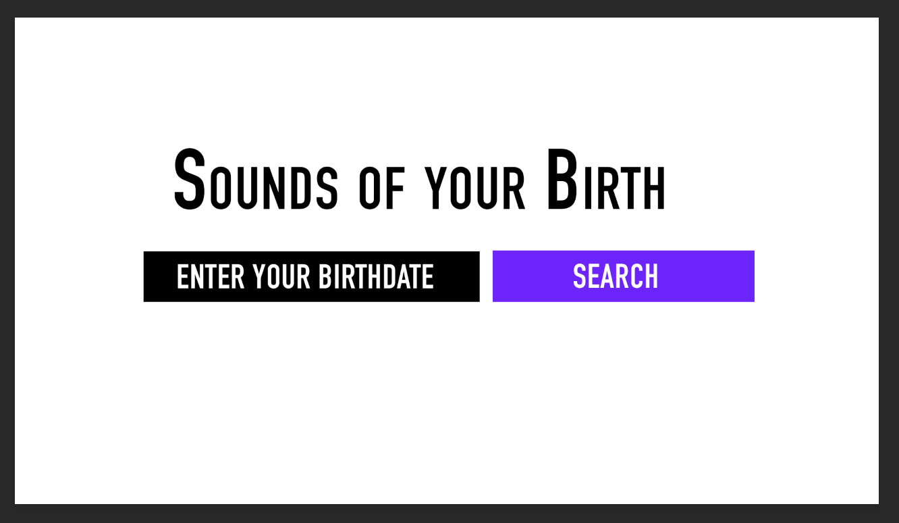
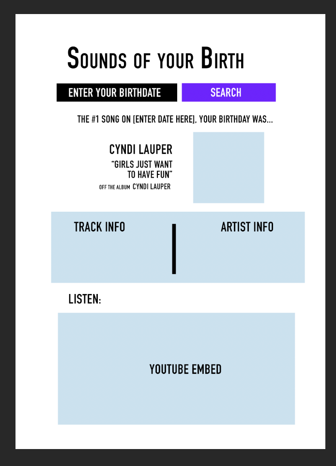
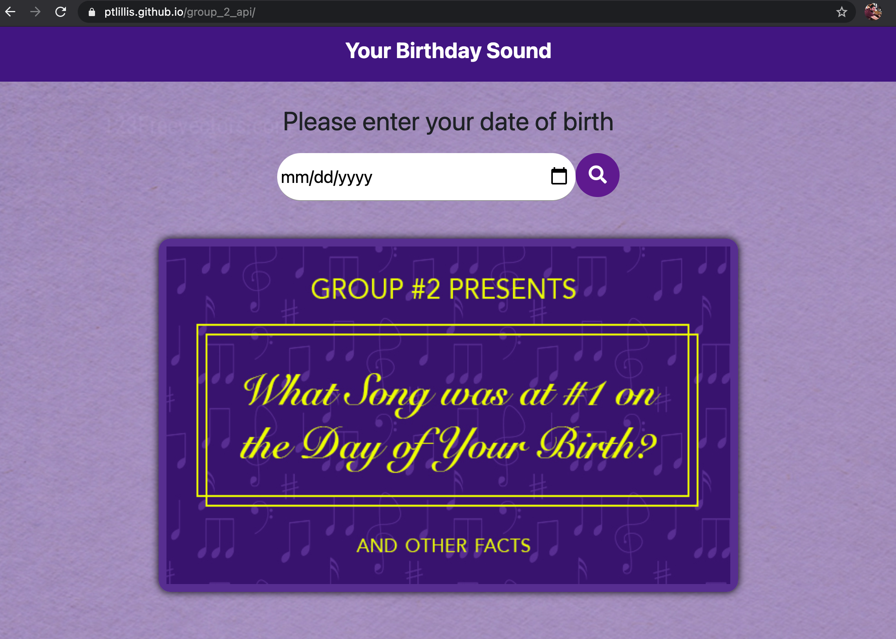

# group_2_api

Project Name: "Sounds of your Birth"

Description:

A tool that receives inputted data from user on when they were born (month, day , year), and returning a report on what song was top of the Billboard charts that day.
Parsing different objects from several APIs, the Sounds of your Birth will be a fun activity for users to learn about their past and life through song and data.

Mockup:

(/assets/Screen Shot 2020-12-15 at 9.16.07 PM.png)

Team Members:
Zaid A: CSS, HTML, JS
Mishel B: CSS, HTML, wireframing, API research
Arjun G: JavaScript, API research, ajax front end designer.
Peter L: repo management, API research, ajax, HTML wireframing, CSS

